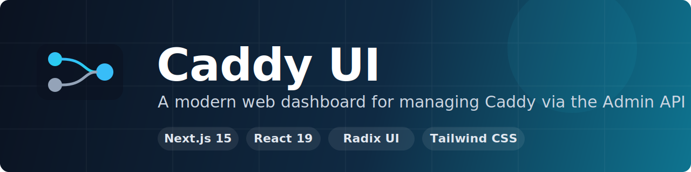
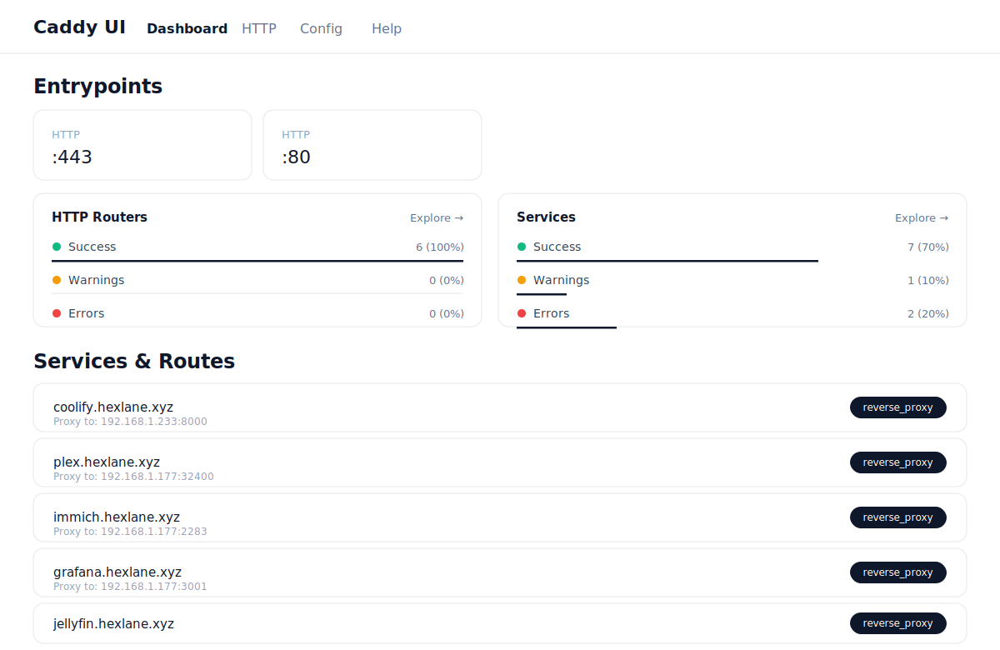
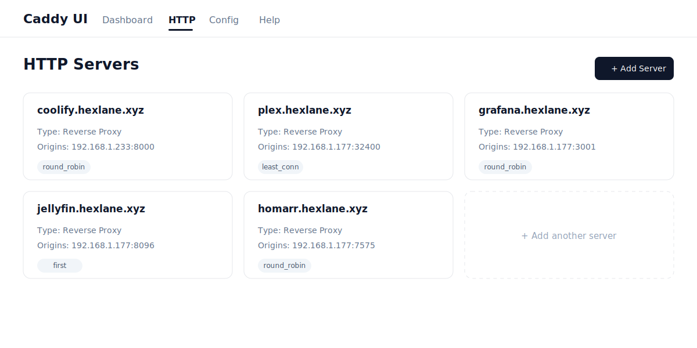
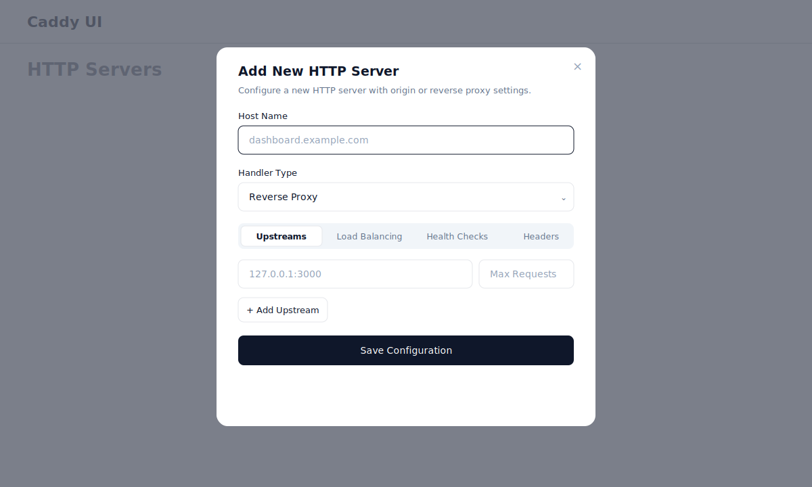
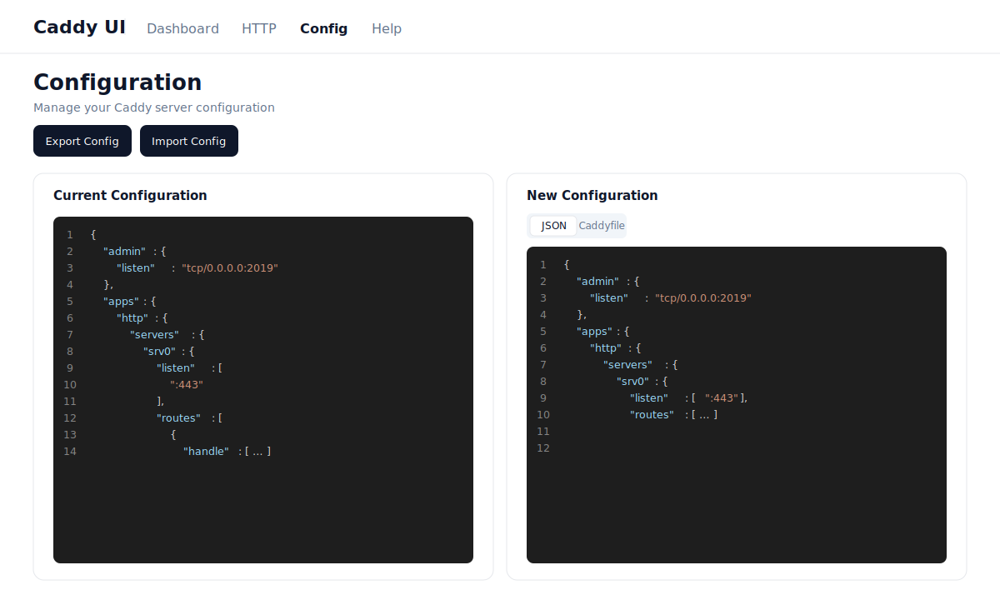

<p align="center">
  
</p>

<p align="center">
  A modern web dashboard for managing <a href="https://caddyserver.com/">Caddy</a> reverse-proxy instances through the <a href="https://caddyserver.com/docs/api">Admin API</a>.
</p>

<p align="center">
  <a href="https://github.com/bernardotwistag/CaddyUI/actions/workflows/deploy.yml"></a>
  <a href="https://hub.docker.com/r/nebulatrader/caddy-ui"></a>
  <a href="https://hub.docker.com/r/nebulatrader/caddy-ui/tags"></a>
  
  <a href="https://github.com/bernardotwistag/CaddyUI/tags"></a>
  
</p>

<p align="center">
  
  
  
  
</p>

---

## Screenshots

> Vector recreations of a live instance — the same pages and layout you get out of the box.

### Dashboard
At-a-glance view of entrypoints, router/service health, and every route.



### HTTP Servers
Add, edit, and delete reverse-proxy servers and routes.



### Add a Reverse Proxy
Configure upstreams, load balancing, health checks, and headers from one dialog.



### Configuration
Inspect and edit the full Caddy config in JSON or Caddyfile, side by side.



## Features

- **Dashboard** — overview of HTTP entrypoints, routers, services, and route details at a glance
- **HTTP Server Management** — add, edit, and delete servers and routes with reverse-proxy support (upstreams, load balancing, health checks, headers)
- **Configuration Editor** — view and edit the full Caddy config in JSON or Caddyfile syntax with Monaco Editor, side-by-side comparison, and import/export
- **Upstream Monitoring** — track upstream servers, request counts, and failure metrics
- **In-app update notifications** — a header indicator and `/help` page tell you when a newer image is available, with redeploy instructions
- **Health endpoint** — `/api/health` for container/orchestrator liveness checks

## Caddy Admin API support

Caddy UI talks to Caddy through a built-in proxy (`/api/caddy-proxy/[...path]`) which forwards **GET, POST, PUT, PATCH, DELETE,** and **OPTIONS** to any admin endpoint. The table below shows which endpoints have first-class client/UI support.

| Caddy Admin API endpoint | Method | Purpose | Status |
|---|---|---|:--:|
| `/load` | POST | Replace the entire active configuration | ✅ Supported |
| `/config/[path]` | GET | Export config (or a subpath) | ✅ Supported |
| `/config/[path]` | POST | Set/replace an object, or append to an array | ✅ Supported |
| `/config/[path]` | PATCH | Replace an existing object or array element | ✅ Supported |
| `/config/[path]` | DELETE | Delete the value at a path | ✅ Supported |
| `/config/[path]` | PUT | Create a new object / insert into an array | 🟡 Proxy only¹ |
| `/adapt` | POST | Adapt a Caddyfile to JSON (without loading) | ✅ Supported |
| `/stop` | POST | Stop the active config and exit the process | ✅ Supported |
| `/reverse_proxy/upstreams` | GET | Current status of configured upstreams | ✅ Supported |
| `/pki/ca/<id>` | GET | Info about a PKI app CA | ✅ Supported |
| `/pki/ca/<id>/certificates` | GET | Certificate chain of a CA | ✅ Supported |
| `/id/<id>` | any | Address config objects by `@id` | ❌ Not yet |
| `/metrics` | GET | Prometheus metrics | ❌ Not yet |

¹ The proxy forwards `PUT` requests, but there is no dedicated client helper or UI action for it yet.

> **Handlers:** the server form currently exposes the **`reverse_proxy`** and **`origin`** handlers. Others (`file_server`, `headers`, `rewrite`, `static_response`, …) are scaffolded in the code but commented out.

## Prerequisites

- [Node.js](https://nodejs.org/) 20+ (for local development)
- A running Caddy instance with the [admin API](https://caddyserver.com/docs/caddyfile/options#admin) enabled
- Docker (optional, for containerized deployment)

## Quick Start

### 1. Clone the repository

```bash
git clone https://github.com/bernardotwistag/CaddyUI.git
cd CaddyUI
```

### 2. Configure the environment

```bash
cp .env.example .env
```

Edit `.env` and set `CADDY_ADMIN_URL` to your Caddy admin API address:

```env
CADDY_ADMIN_URL=http://localhost:2019
```

### 3. Install dependencies and run

```bash
yarn install
yarn dev
```

Open [http://localhost:3000](http://localhost:3000) in your browser.

## Deployment

### Docker Hub (recommended)

A pre-built, auto-updated image is published on every push to `main`:

```bash
docker run -d -p 3000:3000 \
  -e CADDY_ADMIN_URL=http://your-caddy-host:2019 \
  nebulatrader/caddy-ui:latest
```

### Docker (build locally)

```bash
docker build -t caddy-ui .
docker run -d -p 3000:3000 -e CADDY_ADMIN_URL=http://your-caddy-host:2019 caddy-ui
```

### Docker Compose

```bash
# Edit docker-compose.yml and set CADDY_ADMIN_URL
docker compose up -d
```

### Coolify

1. Create a new application in Coolify using **Docker Image** as the build pack
2. Set the image to `nebulatrader/caddy-ui:latest`
3. Add environment variable `CADDY_ADMIN_URL` pointing to your Caddy admin API
4. Set the port to `80` and optionally map a host port (e.g. `3080:80`)
5. Deploy

> **Note:** If your Caddy instance runs as `caddy-docker-proxy` alongside Coolify, use the Docker network hostname (e.g. `http://coolify-proxy:2019`) as the `CADDY_ADMIN_URL` — both containers must be on the same Docker network.

## Configuration

| Variable | Description | Default |
|---|---|---|
| `CADDY_ADMIN_URL` | URL of the Caddy admin API | `http://localhost:2019` |
| `ADMIN_PASSWORD` | Password to log in. **If empty, the UI runs without auth** (a warning is logged). | _(unset)_ |
| `SESSION_SECRET` | Secret used to sign session cookies | derived from `ADMIN_PASSWORD` |
| `SESSION_TTL_HOURS` | Session lifetime in hours | `168` |
| `GITHUB_REPO` | Repo checked for update notifications | `bernardotwistag/CaddyUI` |
| `GITHUB_BRANCH` | Branch checked for update notifications | `main` |

### Authentication

Set `ADMIN_PASSWORD` to require a single password to access the UI. A signed, httpOnly session
cookie is issued on login; **all routes and the `/api/caddy-proxy/*` admin proxy are protected**
(only `/login`, `/api/auth/*`, and `/api/health` are public). Leaving `ADMIN_PASSWORD` unset
runs the UI without authentication — fine on a trusted private network, not recommended when
exposed.

### Enabling the Caddy Admin API

The admin API must be enabled and accessible from wherever Caddy UI is running.

**Standard Caddy** — add to your Caddyfile:

```caddyfile
{
    admin 0.0.0.0:2019
}
```

**caddy-docker-proxy** — the admin API defaults to `localhost:2019` and ignores the Caddyfile global block. Patch it at runtime:

```bash
curl -X PATCH \
  -H "Content-Type: application/json" \
  -d '{"listen":"tcp/0.0.0.0:2019"}' \
  http://localhost:2019/config/admin/
```

This resets on every container restart. To make it persistent, use a systemd service or startup script that re-applies the patch after each restart.

## Architecture

```
Browser → Caddy UI (:3000) → /api/caddy-proxy/* → Caddy Admin API (:2019)
```

The app includes a built-in API proxy (`/api/caddy-proxy/[...path]`) that forwards requests to the Caddy admin API with CORS handling and server-side error logging. This avoids browser CORS issues when the Caddy API is on a different origin.

## Health & updates

- **`GET /api/health`** returns `{ status, version, uptime, timestamp }` for liveness checks (used by the container `HEALTHCHECK`).
- **`GET /api/version`** compares the running build against `package.json` on the default branch and reports whether an update is available.
- The **CI pipeline** auto-bumps the version, builds, and publishes `nebulatrader/caddy-ui:latest` + a version tag on every push to `main`.

## Tech Stack

- **Next.js 15** with Turbopack
- **React 19** + Radix UI components
- **Tailwind CSS** with dark/light theme support
- **Monaco Editor** for JSON and Caddyfile editing
- **TanStack React Query** for data fetching
- **React Hook Form** + Zod for form validation
- **Lucide** icons

## Development

```bash
yarn dev        # Start dev server with Turbopack
yarn build      # Production build
yarn start      # Start production server
yarn lint       # Run ESLint
```

## License

MIT
